# 🎓 LLM-Thesis-Project  

## 📖 Description
**Thesis Title:**  
*Analysis of spatial reasoning capabilities of LLMs in 2D vertical interactive grid-based environments via in-context learning: the case of Space Invaders*  

**Context:**  
This thesis investigates the ability of Large Language Models (LLMs) to **reason in dynamic environments** that require not only accurate **spatial interpretation**, but also strong **context adaptation**.  
The experimental setup is based on a simplified but interactive 2D grid-based game environment — **Space Invaders** — which provides a meaningful scenario to test skills such as:  
- Object tracking  
- Movement prediction  
- Complex logical reasoning for selecting effective actions based on the current game state  

The main aim is to evaluate how **in-context learning**, supported by tailored **prompting strategies**, can help overcome some of the **current limitations of LLMs** and inspire future applications in **complex and interactive environments**.  

---


## 🎮 Demo
<p align="center">
  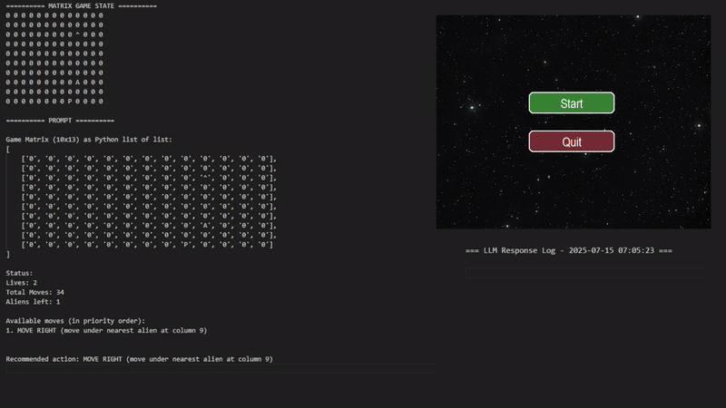
</p>


---

## 🎯 Goals
The main goals of this thesis are:  
- **Evaluate** the ability of LLMs to understand complex game dynamics expressed in natural language  
- **Explore** prompting strategies to induce behaviors consistent with the environmental context  
- **Analyze** the decision-making performance of different models depending on the chosen **spatial representations** and **exploration strategies**, comparing results across models and input formats  

Finally, the work provides a **critical discussion** of the current limitations of LLMs in tasks requiring implicit spatial representation and environmental interaction, while highlighting potential directions for **future development**.  


---


## 🧩 Main Challenges & Solutions
1. **Encoding the game state for the models**  
   🔹 *Challenge:* defining how to represent a dynamic game state.  
   🔹 *Solution:* adoption of a **2D grid/matrix representation**, updated after every interaction.

   <p align="center">
      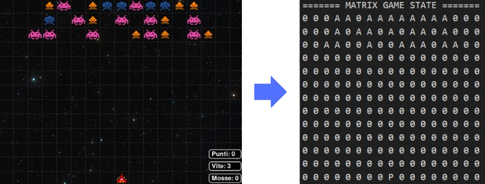
   </p>

3. **Model interaction**  
   🔹 *Challenge:* ensuring coherent communication with LLMs.  
   🔹 *Solution:* implementation of a **client-server architecture** using **chat templates** to structure prompts.

   <p align="center">
      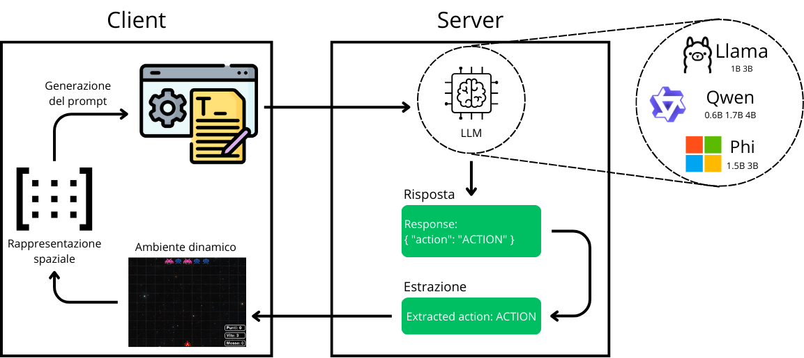
   </p>

5. **Game map representation**  
   🔹 *Challenge:* determining the most effective representation for model understanding.  
   🔹 *Solution:* experiments with different input formats:  
   - Direct matrix  
   - Matrix as list of lists  
   - Matrix as list of tuples  
   - Only positions of game elements  

   Alongside this, **exploration strategies** (available moves, planned trajectories) were tested to measure their impact on model comprehension and performance.  


---


## ⚙️ How to Run
To execute the project:  

1. Obtain a **Hugging Face Token** (required to access the models).  
2. Start the server:  
   ```bash
   python server.py
3. Start the project:  
   ```bash
   python main.py


---


## 📊 Results per Model  

### 🦙 LLaMA  
<p align="center">
  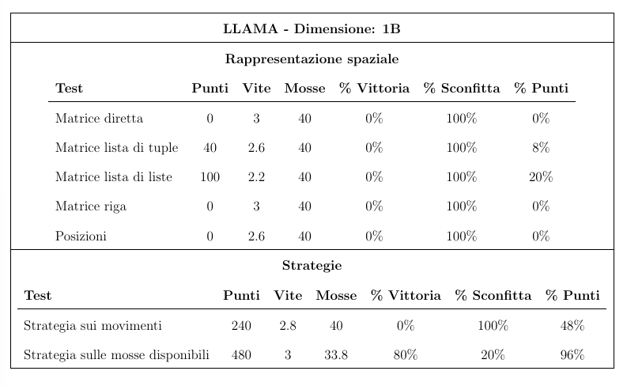
  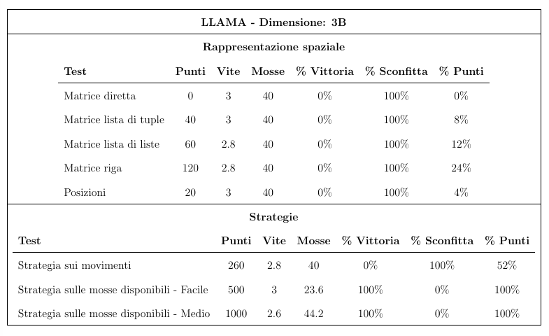
</p>

### 🐘 Phi  
<p align="center">
  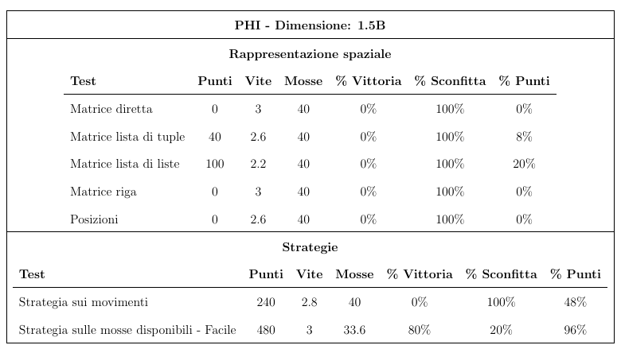
  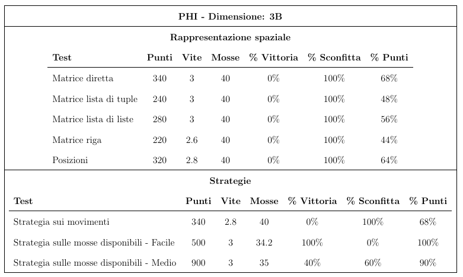
</p>

### 🐦 Qwen  
<p align="center">
  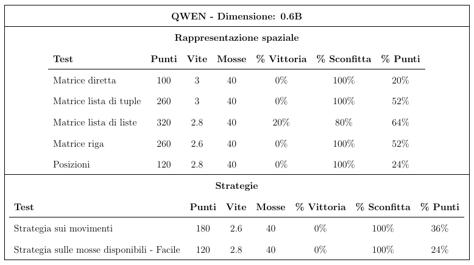
  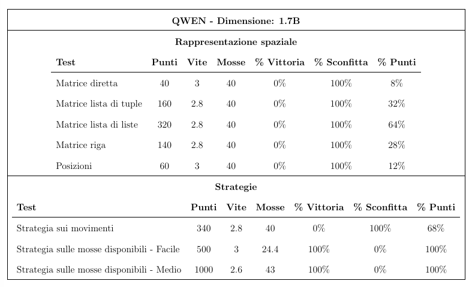
  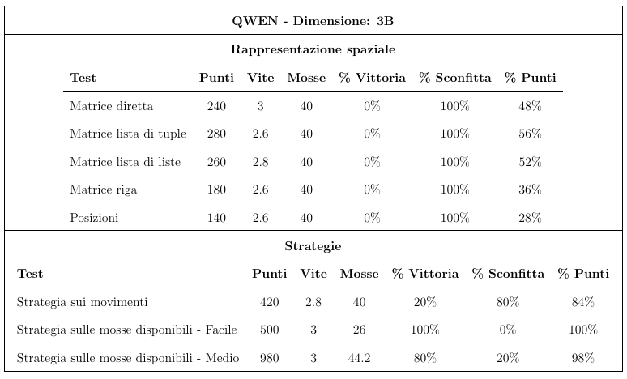
</p>


---


## 📊 Comparative Results  

<p align="center">
  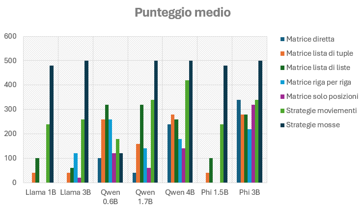
  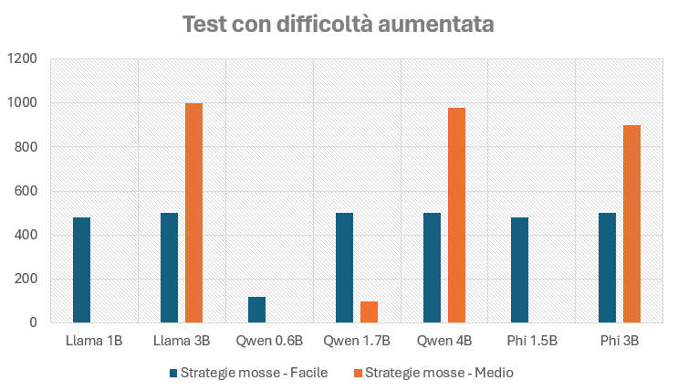
  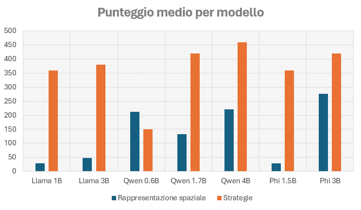
</p>

**Description:**  
- **Left:** Comparison using average points
- **Center:** Effect of increasing game difficulty on reasoning ability  
- **Right:** Overall models overview based off points


---


## 📊 Conclusions

The thesis analyzed the **spatial reasoning capabilities of Large Language Models (LLMs)** in dynamic 2D environments through **in-context learning** and **prompt engineering**.  

Key observations from the experiments:  
- **Smaller models** are able to follow simple game rules but struggle with spatial complexity, often producing *hallucinations*. With tailored strategies, however, even smaller models can perform logical actions.  
- **Larger models** demonstrated better map comprehension, even without strategies, but still showed limitations when the environment became too complex.  
- The **gap between small and large models** increased with game difficulty, underlining the importance of model size in handling complex scenarios.  
- The **upper bound analysis with ChatGPT** showed that bigger models require less detailed prompting to generate coherent outputs.  
- Overall, results confirm that while LLMs are not explicitly trained for logical reasoning in spatial tasks, they can **adapt to novel environments if guided with effective prompts**.  

This highlights the potential of LLMs to exhibit useful behaviors in **dynamic and interactive environments**, even without explicit spatial representations.  


---


## 🚀 Future Work  

- Deploy larger models on dedicated servers with higher computational power  
- Investigate a **multi-model pipeline**, where one LLM generates detailed prompts for another model performing reasoning  
- Explore models capable of **direct matrix interpretation**, avoiding the limitations of text encoding for spatial understanding  

   
---


## 👨‍💻 Author
Developed by **Carmine Gualtieri**

📧 [Email](mailto:gualtieri.cb21@gmail.com)  
🔗 [LinkedIn](https://www.linkedin.com/in/carmine-gualtieri-580562358) | [GitHub](https://github.com/Gualt17)  
